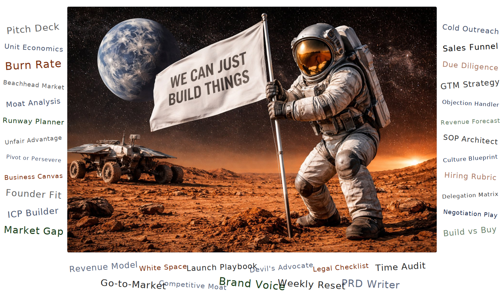

<div align="center">



<br/>

[](LICENSE)
[](prompts/)
[](prompts/)
[](#-works-with-any-llm)
[](https://github.com/KunalCyber/ultimate-prompt-library-for-founders)

<br/>

> **50 production-grade prompts for founders, CEOs, and business leaders.**
> Every prompt follows Anthropic best-practice prompt engineering.
> Every output is structured, specific, and immediately usable.

<br/>

[**→ Browse All Prompts**](#prompt-library) · [**→ How to Use**](#how-to-use) · [**→ Download Excel**](#download) · [**→ Contribute**](#contributing)

</div>

---

## What This Is

Most AI prompts produce vague, generic output that requires hours of cleanup before it is usable. This library is different.

Every prompt in this collection is engineered to a production standard. Each one uses the full Anthropic prompt engineering stack: explicit role assignment, XML tag structure, placeholder variables, exact output format definitions, chain-of-thought reasoning for complex analysis, and a self-check evaluation block. The result is structured, specific, immediately usable output, every time.

This is not a list of one-liners. These are complete prompt systems built for the highest-stakes decisions a founder faces.

---

## Who This Is For

| Role | How You Use This |
|------|-----------------|
| **Founders and CEOs** | Validate ideas, build models, plan fundraises, design GTM, without hiring consultants for every decision |
| **Startup operators** | SOPs, hiring rubrics, vendor evaluations, weekly planning: the operational stack, automated |
| **Consultants and advisors** | Client-ready deliverables in minutes, not days |
| **Students and early-career** | Learn how senior practitioners think about every domain of business |

---

## Prompt Library

### 01 · Business Model Foundations
*The prompts you need before you write a line of code or spend a dollar.*

| # | Prompt | Level | What It Produces |
|---|--------|-------|-----------------|
| 01 | [Startup Idea Validator](prompts/01-business-model-foundations/01-startup-idea-validator.md) | Essential | RAG verdict across problem, market, competition, founder-market fit + 3 validation experiments |
| 02 | [Founder-Problem-Market Fit Analyser](prompts/01-business-model-foundations/02-founder-problem-market-fit-analyser.md) | Practitioner | Scores fit across 3 dimensions, names your single most dangerous knowledge gap |
| 03 | [Business Model Canvas Builder](prompts/01-business-model-foundations/03-business-model-canvas-builder.md) | Essential | All 9 blocks with embedded assumptions and a weakest-block priority action |
| 04 | [MVP Scope and Validation Designer](prompts/01-business-model-foundations/04-mvp-scope-and-validation-experiment-designer.md) | Practitioner | Assumption risk matrix + pre-build validation experiment design |
| 05 | [Beachhead Market Selector](prompts/01-business-model-foundations/05-beachhead-market-selector.md) | Advanced | Weighted scoring across 6 criteria with one unambiguous recommendation |
| 06 | [One-Page Business Clarity Document](prompts/01-business-model-foundations/06-one-page-business-clarity-document.md) | Essential | Six-section clarity document with honesty scores and improved alternatives |

### 02 · Market Research and Competitive Intelligence
*Know your market better than anyone else in the room.*

| # | Prompt | Level | What It Produces |
|---|--------|-------|-----------------|
| 07 | [Market Sizing and Opportunity Analyser](prompts/02-market-research/07-market-sizing-and-opportunity-analyser.md) | Practitioner | TAM/SAM/SOM with documented assumptions + investor-ready narrative |
| 08 | [Competitor Landscape Mapper](prompts/02-market-research/08-competitor-landscape-mapper.md) | Practitioner | Direct, indirect, and status quo competitor profiles with positioning statement |
| 09 | [Competitor Review Pain-Point Miner](prompts/02-market-research/09-competitor-review-pain-point-miner.md) | Practitioner | Cross-competitor frustrations converted into 3 ready-to-use messaging angles |
| 10 | [Market Gap and White Space Identifier](prompts/02-market-research/10-market-gap-and-white-space-identifier.md) | Advanced | Competitive clustering + pricing gaps mapped to a specific occupiable position |

### 03 · Business Model and Strategy
*Build something that lasts. Know why it will.*

| # | Prompt | Level | What It Produces |
|---|--------|-------|-----------------|
| 11 | [Business Model Canvas Builder](prompts/03-business-model-strategy/11-business-model-canvas-builder.md) | Essential | 9 blocks with assumptions + alternative model for better unit economics |
| 12 | [Revenue Model Designer](prompts/03-business-model-strategy/12-revenue-model-designer.md) | Practitioner | 3 model types evaluated + full unit economics at recommended price point |
| 13 | [Competitive Moat Analyser](prompts/03-business-model-strategy/13-competitive-moat-and-defensibility-analyser.md) | Practitioner | 6 moat types scored, stress-tested against a named attacker |
| 14 | [Business Model Devil's Advocate](prompts/03-business-model-strategy/14-business-model-stress-test-and-devils-advocate.md) | Advanced | Hidden assumptions, structural failure points, VC bear case |
| 15 | [Pivot vs Persevere Framework](prompts/03-business-model-strategy/15-pivot-vs-persevere-decision-framework.md) | Advanced | Signal/noise classification + direct Persevere, Pivot, or Stop recommendation |
| 16 | [Unfair Advantage Finder](prompts/03-business-model-strategy/16-unfair-advantage-finder.md) | Essential | Advantages inventoried, scored, with exploitation strategies |

### 04 · Financial Planning and Modelling
*The numbers that matter. Calculated properly.*

| # | Prompt | Level | What It Produces |
|---|--------|-------|-----------------|
| 17 | [Startup Budget and Cost Builder](prompts/04-financial-planning/17-startup-budget-and-cost-structure-builder.md) | Essential | Month-by-month burn table + break-even revenue as a sales target |
| 18 | [Unit Economics Analyser](prompts/04-financial-planning/18-unit-economics-and-pricing-analyser.md) | Practitioner | Full CAC, LTV, payback with Series A benchmarking |
| 19 | [Burn Rate and Runway Planner](prompts/04-financial-planning/19-burn-rate-and-runway-scenario-planner.md) | Practitioner | 3 scenarios + trigger points for raise/cut/cash-flow-positive |
| 20 | [Revenue Forecast Builder](prompts/04-financial-planning/20-revenue-forecast-and-financial-projection-builder.md) | Advanced | Bottom-up 12-month ARR build + 3-year projection with assumption register |

### 05 · Fundraising, Pitch and Investor Strategy
*Raise on your terms. Walk in prepared.*

| # | Prompt | Level | What It Produces |
|---|--------|-------|-----------------|
| 21 | [Funding Route Evaluator](prompts/05-fundraising-pitch/21-funding-route-evaluator.md) | Essential | All viable routes scored on 4 dimensions + 3 pre-approach actions |
| 22 | [Pitch Deck Narrative Architect](prompts/05-fundraising-pitch/22-pitch-deck-narrative-architect.md) | Practitioner | Slide-by-slide script: key message, visual direction, speaker notes |
| 23 | [Investor Targeting Brief](prompts/05-fundraising-pitch/23-investor-targeting-and-research-brief.md) | Practitioner | 3-tier investor list + personalisation angles + cold email template |
| 24 | [Investor Update Template](prompts/05-fundraising-pitch/24-investor-update-and-stakeholder-report-template.md) | Practitioner | Structured update: status, metrics, challenges with responses, specific asks |
| 25 | [Due Diligence Preparation Pack](prompts/05-fundraising-pitch/25-due-diligence-preparation-pack.md) | Advanced | 6-category DD checklist with severity ratings + preparation timeline |

### 06 · Go-to-Market and Launch
*Get to market fast. Get it right first time.*

| # | Prompt | Level | What It Produces |
|---|--------|-------|-----------------|
| 26 | [Ideal Customer Profile Builder](prompts/06-go-to-market/26-ideal-customer-profile-and-persona-builder.md) | Practitioner | Firmographic ICP + buyer personas + trigger events + disqualifiers |
| 27 | [GTM Strategy and Channel-Market Fit](prompts/06-go-to-market/27-go-to-market-strategy-and-channel-market-fit-analyser.md) | Advanced | 6 channels scored + primary motion designed + 30/60/90-day signals |
| 28 | [Launch Playbook Builder](prompts/06-go-to-market/28-launch-playbook-and-checklist-builder.md) | Practitioner | Pre-launch, launch day, post-launch checklists with owners and definitions of done |

### 07 · Marketing and Brand
*Sound different. Be remembered.*

| # | Prompt | Level | What It Produces |
|---|--------|-------|-----------------|
| 29 | [Brand Voice and Messaging Guide](prompts/07-marketing-brand/29-brand-voice-and-messaging-guide.md) | Practitioner | Voice principles + message hierarchy + 10 before/after copy examples |
| 30 | [Content Strategy and Calendar](prompts/07-marketing-brand/30-content-strategy-and-calendar-architect.md) | Practitioner | 3 differentiated pillars + 90-day calendar + adjustment triggers |
| 31 | [Thought Leadership Architect](prompts/07-marketing-brand/31-thought-leadership-content-architect.md) | Practitioner | Publish-ready piece + 3 alternative hooks + quality scoring |
| 32 | [Personal Brand Positioning](prompts/07-marketing-brand/32-personal-brand-positioning-statement.md) | Essential | Brand position + LinkedIn About + cross-platform messaging + 12-week plan |

### 08 · Sales and Revenue Growth
*Close more. Discount less. Build a machine.*

| # | Prompt | Level | What It Produces |
|---|--------|-------|-----------------|
| 33 | [Sales Funnel Architect](prompts/08-sales-revenue/33-sales-funnel-architect.md) | Practitioner | Stages as buyer commitments + conversion metrics + impact-projected improvements |
| 34 | [Cold Outreach Sequence Builder](prompts/08-sales-revenue/34-prospect-aware-cold-outreach-sequence-builder.md) | Practitioner | Multi-touch sequence + trigger-event variants + follow-up decision tree |
| 35 | [Objection Handler and Battle Card](prompts/08-sales-revenue/35-objection-handler-and-battle-card-builder.md) | Practitioner | Acknowledge-reframe-evidence responses + one-page mid-call battle card |
| 36 | [Pricing and Negotiation Playbook](prompts/08-sales-revenue/36-pricing-strategy-and-negotiation-playbook.md) | Advanced | Concession framework + walk-away points + 3 negotiation scripts as dialogue |

### 09 · Product and Engineering
*Build the right thing. Build it right.*

| # | Prompt | Level | What It Produces |
|---|--------|-------|-----------------|
| 37 | [Product Requirements Document Writer](prompts/09-product-engineering/37-product-requirements-document-writer.md) | Practitioner | Binary acceptance criteria + success metrics + explicit out-of-scope |
| 38 | [Feature Prioritisation and Roadmap](prompts/09-product-engineering/38-feature-prioritisation-and-roadmap-builder.md) | Practitioner | Weighted scoring across 5 dimensions + phased roadmap by team capacity |
| 39 | [Build vs Buy vs Partner Framework](prompts/09-product-engineering/39-build-vs-buy-vs-partner-decision-framework.md) | Advanced | Scored evaluation + reversibility assessment + single clear recommendation |

### 10 · Operations and Process Design
*Systems that scale without you.*

| # | Prompt | Level | What It Produces |
|---|--------|-------|-----------------|
| 40 | [SOP Architect](prompts/10-operations/40-sop-architect.md) | Essential | Single-action steps + binary definitions of done + failure recovery procedures |
| 41 | [Workflow Optimisation and Bottleneck Identifier](prompts/10-operations/41-workflow-optimisation-and-bottleneck-identifier.md) | Practitioner | Root cause classification + optimised workflow with projected cycle time |
| 42 | [Vendor and Tool Stack Evaluator](prompts/10-operations/42-vendor-and-tool-stack-evaluator.md) | Practitioner | Must-have filter + weighted scoring + recommendation + second-place scenario |

### 11 · People, Culture and Hiring
*Hire the right people. Build the right culture.*

| # | Prompt | Level | What It Produces |
|---|--------|-------|-----------------|
| 43 | [Job Description and Role Architect](prompts/11-people-culture/43-job-description-and-role-architect.md) | Essential | 30/90/180-day milestones + observable requirements + culture statements that filter |
| 44 | [Interview Scorecard and Hiring Rubric](prompts/11-people-culture/44-interview-scorecard-and-hiring-rubric-builder.md) | Practitioner | STAR question bank + observable scoring rubric + red flag indicators |
| 45 | [Culture and Values Blueprint](prompts/11-people-culture/45-company-culture-and-values-blueprint.md) | Practitioner | Behaviours + anti-behaviours + decision principles + anti-patterns map |

### 12 · Legal, Compliance and Risk Foundations
*Know what you need. Know what it costs when you skip it.*

| # | Prompt | Level | What It Produces |
|---|--------|-------|-----------------|
| 46 | [Startup Legal Checklist](prompts/12-legal-compliance/46-startup-legal-checklist-and-structure-advisor.md) | Essential | 5-category checklist with urgency ratings + pre-fundraise readiness |
| 47 | [Founder Agreement Clause Generator](prompts/12-legal-compliance/47-founder-agreement-and-contract-clause-generator.md) | Practitioner | Clause library + plain-English explanations + negotiation points |

### 13 · Leadership, Productivity and Decision-Making
*Think clearly. Decide well. Build deliberately.*

| # | Prompt | Level | What It Produces |
|---|--------|-------|-----------------|
| 48 | [High-Stakes Decision Maker](prompts/13-leadership-productivity/48-high-stakes-decision-maker.md) | Practitioner | Criteria-weighted matrix + pre-mortem + decision record with review trigger |
| 49 | [Delegation Matrix and Time Audit](prompts/13-leadership-productivity/49-delegation-matrix-and-time-audit.md) | Essential | 2x2 categorisation + delegation plan + under-investment analysis |
| 50 | [Weekly Founder Reset and Priority Planner](prompts/13-leadership-productivity/50-weekly-founder-reset-and-priority-planner.md) | Practitioner | Blocker type classification + 3 goal-anchored priorities + energy-managed plan |

---

## How to Use

Every prompt in this library follows the same structure. Copy. Fill. Run.

```
1. Find the prompt for your situation (use the table above or the Decision Tree in the Excel file)
2. Copy the full prompt text from the .md file
3. Replace all [BRACKETED_VARIABLES] with your specific context
4. Paste into Claude, GPT-4o, Gemini, or any capable LLM
5. Get a structured, specific, immediately usable output
```

### The Prompt Structure

Every prompt uses Anthropic's best-practice engineering framework:

```xml
<role>
  Specific expert role with domain experience
</role>

<context>
  [YOUR_VARIABLES] , fill these in before running
</context>

<instructions>
  Step 1: ...
  Step 2: ...
  Step N: Compile into the output format below
</instructions>

<output_format>
  Exact specification of tables, sections, columns, scoring scales
</output_format>

<constraints>
  What to avoid, quality guardrails, specificity requirements
</constraints>

<evaluation_criteria>
  Self-check the AI runs before delivering output
</evaluation_criteria>
```

### Skill Levels

| Level | Who It's For |
|-------|-------------|
| **Essential** | Any founder, any stage. No prior knowledge needed. Run it today. |
| **Practitioner** | You understand the domain and want structured depth. |
| **Advanced** | Complex situations. Multi-step analysis. Chain-of-thought reasoning. |

---

## Works With Any LLM

These prompts are tested and optimised for Claude (recommended) but work with any major LLM:

| Model | Performance | Notes |
|-------|-------------|-------|
| **Claude 3.5+ / Claude 4** | ⭐⭐⭐⭐⭐ | Best results. Follows XML structure precisely. |
| **GPT-4o** | ⭐⭐⭐⭐⭐ | Excellent. Full XML support. |
| **Gemini 1.5 Pro / 2.0** | ⭐⭐⭐⭐ | Very good. Minor formatting variations. |
| **Llama 3.1 70B+** | ⭐⭐⭐⭐ | Good. May need slight output format nudging. |
| **Mistral Large** | ⭐⭐⭐ | Solid on Essential/Practitioner. Advanced prompts may need tweaking. |

---

## Download

The complete library is available as a premium Excel file with:

- Cover page and full Contents index
- Decision Tree: find the right prompt for your situation in 30 seconds
- Individual sheets for all 50 prompts with variables, prompt, why-it-works, and sample output
- Domain colour coding across all 13 domains
- Internal navigation: every prompt links back to Contents and Decision Tree

**[→ Download the Excel File](assets/The_Ultimate_Prompt_Library.xlsx)** · Free · All 50 prompts · One file · No sign-up required

The Excel file includes the full prompt library with a Cover page, Contents index, Decision Tree, and individual sheets for all 50 prompts , each with variables table, the prompt, why-it-works, and sample output. Navigate between prompts with one click.

---

## Repository Structure

```
ai-prompt-library/
│
├── README.md                          ← You are here
├── assets/
│   └── banner.svg                     ← Repo banner
│
└── prompts/
    ├── 01-business-model-foundations/
    │   ├── 01-startup-idea-validator.md
    │   ├── 02-founder-problem-market-fit.md
    │   └── ...
    ├── 02-market-research/
    ├── 03-business-model-strategy/
    ├── 04-financial-planning/
    ├── 05-fundraising-pitch/
    ├── 06-go-to-market/
    ├── 07-marketing-brand/
    ├── 08-sales-revenue/
    ├── 09-product-engineering/
    ├── 10-operations/
    ├── 11-people-culture/
    ├── 12-legal-compliance/
    └── 13-leadership-productivity/
```

---

## Prompt Engineering Standards

Every prompt in this library meets these standards:

- **Role specificity**: Not "business consultant" but "SaaS pricing strategist with 15 years of B2B subscription experience"
- **XML tag structure**: `<role>`, `<context>`, `<instructions>`, `<output_format>`, `<constraints>`, `<evaluation_criteria>`
- **Placeholder variables**: Every user input is a named `[BRACKETED_VARIABLE]` with a description and example
- **Exact output format**: Tables, scoring scales, section headers, word counts , no ambiguity in what the output looks like
- **Evaluation criteria**: The AI self-checks its output before delivering
- **Chain-of-thought**: Advanced prompts require step-by-step reasoning before producing output
- **British English**: Throughout. Organise, not organize. Behaviour, not behavior.
- **Zero filler phrases**: No "it is worth noting", no "in today's rapidly evolving landscape", no em dashes

---

## Contributing

Found a prompt that could be better? Have a domain that's missing? Contributions welcome.

**To contribute a new prompt:**

1. Fork the repository
2. Create a new branch: `git checkout -b prompt/your-prompt-name`
3. Copy the [prompt template](.github/PROMPT_TEMPLATE.md) and build your prompt
4. Submit a pull request with the prompt title, domain, level, and a sample output

**Quality bar for contributions:**
- Must use the full XML structure
- Must have at least 4 placeholder variables
- Must include a specific, non-generic sample output
- Must pass the evaluation criteria self-check
- Must follow British English

---

## Licence

MIT Licence. Use freely, commercially or personally. Attribution appreciated but not required.

Built on [Anthropic prompt engineering principles](https://docs.anthropic.com/en/docs/build-with-claude/prompt-engineering/overview).

---

<div align="center">

**Built by [Kunal RK](https://www.linkedin.com/in/kunal-rk-a255aa301)**

*I build high-quality, practical tools for founders and professionals. This library is completely free. No paywall. No sign-up. Just use it.*

<br/>

If this library saves you time or helps you think more clearly about your business, a ⭐ goes a long way.

<br/>

[](https://github.com/KunalCyber/ultimate-prompt-library-for-founders)
[](assets/The_Ultimate_Prompt_Library.xlsx)
[](https://www.linkedin.com/in/kunal-rk-a255aa301)

<br/>

*We Can Just Build Things.*

</div>
